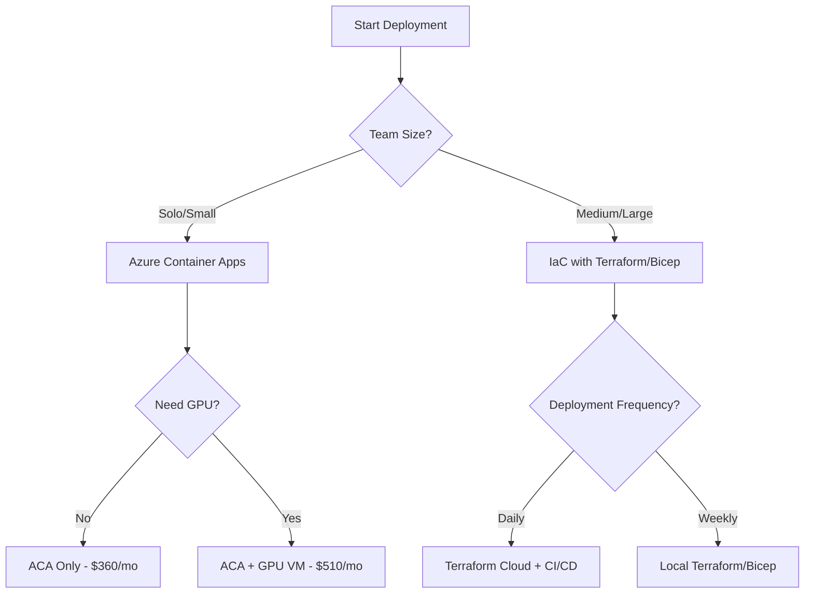

# 🎯 GenAI Stack Azure Deployment Strategy Guide

## Quick Decision Tree



## 🚀 Recommended Path: Azure Container Apps

Based on your requirements for **manageable, predefined deployment** with **interconnected services**, we recommend:

### **Primary Strategy: Azure Container Apps (ACA)**
- ✅ Direct migration from Docker Compose
- ✅ Managed platform (no Kubernetes complexity)
- ✅ Auto-scaling built-in
- ✅ HTTPS and load balancing included

### **Secondary Strategy: Infrastructure as Code**
- ✅ Reproducible deployments
- ✅ Version control for infrastructure
- ✅ Multi-environment support

## 📋 Implementation Roadmap

### Phase 1: Quick Start (Day 1)
```bash
# Deploy with Azure Container Apps
cd azure-deployment/container-apps
chmod +x deploy-aca.sh
./deploy-aca.sh
```

**What you get:**
- All services running in 30 minutes
- Automatic HTTPS endpoints
- Basic monitoring
- ~$360-560/month cost

### Phase 2: Add IaC (Week 1)
```bash
# Option A: Terraform
cd azure-deployment/iac/terraform
terraform init
terraform plan
terraform apply

# Option B: Bicep (Azure-native)
cd azure-deployment/iac/bicep
az deployment sub create \
  --location eastus \
  --template-file main.bicep \
  --parameters environment=prod
```

**Benefits:**
- Infrastructure versioning
- Disaster recovery
- Team collaboration
- Environment replication

### Phase 3: Optimize (Week 2-3)
- Configure auto-scaling rules
- Set up monitoring dashboards
- Implement cost optimization
- Add CI/CD pipelines

## 🏗️ Architecture Comparison

### Container Apps Architecture
```
┌──────────────────────────────────────────┐
│     Azure Container Apps Environment      │
├──────────────────────────────────────────┤
│  ┌─────────┐ ┌─────────┐ ┌─────────┐   │
│  │Open-Web │ │   n8n   │ │ Backend │   │
│  │   UI    │ │Workflows│ │   API   │   │
│  └─────────┘ └─────────┘ └─────────┘   │
│  Auto-scale  Auto-scale  Auto-scale     │
├──────────────────────────────────────────┤
│         Azure Managed Services           │
│  PostgreSQL │ Redis │ Storage │ OpenAI  │
└──────────────────────────────────────────┘
```

### VM-Based Architecture (Current Scripts)
```
┌──────────────────────────────────────────┐
│          Azure Resource Group            │
├─────────────────┬────────────────────────┤
│    GPU VM       │      Core VM           │
│  (AI Workloads) │  (Web Services)        │
│  Docker Compose │  Docker Compose        │
├─────────────────┴────────────────────────┤
│         Azure Managed Services           │
└──────────────────────────────────────────┘
```

## 💰 Cost Comparison

| Component | Container Apps | VMs | Savings |
|-----------|---------------|-----|---------|
| Compute | $200-300/mo (scale to zero) | $290/mo (always on) | ~$50/mo |
| Management | $0 (managed) | ~$50/mo (time cost) | $50/mo |
| Scaling | Automatic | Manual | Time saved |
| **Total** | **$360-560/mo** | **$510-710/mo** | **~$150/mo** |

## 🔧 Migration Strategy

### From Docker Compose to ACA

1. **Assess Current Setup**
   ```bash
   docker-compose ps
   docker-compose config
   ```

2. **Deploy to ACA**
   ```bash
   # Automatic conversion
   az containerapp compose create \
     --resource-group genai-prod \
     --environment genai-env \
     --compose-file docker-compose.yml
   ```

3. **Configure Services**
   - Update environment variables
   - Configure service connections
   - Set up ingress rules

4. **Validate**
   - Test all endpoints
   - Verify data persistence
   - Check service communication

## 📊 Decision Matrix

| Factor | Container Apps | IaC + VMs | Pure VMs |
|--------|---------------|-----------|----------|
| **Setup Time** | 30 mins | 2 hours | 4 hours |
| **Maintenance** | Minimal | Moderate | High |
| **Scalability** | Automatic | Configured | Manual |
| **Cost** | $$ | $$$ | $$$$ |
| **Control** | Medium | High | Full |
| **GPU Support** | Limited | Full | Full |
| **Team Skills** | Docker | IaC+Docker | Linux+Docker |

## 🎮 Command Cheat Sheet

### Container Apps Management
```bash
# List all apps
az containerapp list -g genai-prod -o table

# Scale an app
az containerapp update -n open-webui -g genai-prod \
  --min-replicas 2 --max-replicas 10

# View logs
az containerapp logs show -n open-webui -g genai-prod --follow

# Update image
az containerapp update -n backend-api -g genai-prod \
  --image myacr.azurecr.io/backend:v2
```

### Terraform Commands
```bash
# Initialize
terraform init

# Plan changes
terraform plan -out=tfplan

# Apply changes
terraform apply tfplan

# Destroy resources
terraform destroy
```

### Bicep Commands
```bash
# Deploy
az deployment sub create \
  --location eastus \
  --template-file main.bicep

# What-if (preview changes)
az deployment sub what-if \
  --location eastus \
  --template-file main.bicep

# Validate template
az bicep build --file main.bicep
```

## 🚨 Important Considerations

### For Power Users
- **Long-running tasks**: Use ACA with background workers
- **Multi-tenancy**: Implement at application level
- **Data isolation**: Use row-level security in PostgreSQL
- **Resource limits**: Configure per-container limits

### For Growth
- **Start with ACA**: Easy to begin, room to grow
- **Add IaC later**: When you need repeatability
- **Consider AKS**: Only if you need full Kubernetes

### For Cost Optimization
- **Use spot instances**: For GPU workloads
- **Scale to zero**: For non-critical services
- **Reserved instances**: For predictable workloads
- **Monitor usage**: Set up cost alerts

## 📚 Resources

### Azure Container Apps
- [Official Documentation](https://docs.microsoft.com/azure/container-apps/)
- [Docker Compose to ACA](https://learn.microsoft.com/azure/container-apps/compose)
- [Scaling Rules](https://learn.microsoft.com/azure/container-apps/scale-app)

### Infrastructure as Code
- [Terraform Azure Provider](https://registry.terraform.io/providers/hashicorp/azurerm/)
- [Bicep Documentation](https://docs.microsoft.com/azure/azure-resource-manager/bicep/)
- [Azure Samples](https://github.com/Azure-Samples)

### Cost Management
- [Azure Pricing Calculator](https://azure.microsoft.com/pricing/calculator/)
- [Cost Management Best Practices](https://docs.microsoft.com/azure/cost-management-billing/)

## ✅ Action Items

1. **Immediate** (Today):
   - [ ] Review deployment options
   - [ ] Choose primary strategy (recommend ACA)
   - [ ] Run deployment script

2. **Short-term** (This Week):
   - [ ] Set up monitoring
   - [ ] Configure auto-scaling
   - [ ] Document procedures

3. **Medium-term** (This Month):
   - [ ] Implement IaC
   - [ ] Set up CI/CD
   - [ ] Optimize costs

4. **Long-term** (Quarter):
   - [ ] Multi-region deployment
   - [ ] Disaster recovery plan
   - [ ] Performance optimization

## 🎯 Final Recommendation

**For your GenAI Stack with power users and long-running tasks:**

1. **Start with Azure Container Apps** [[memory:8437160]]
   - Quick deployment (30 minutes)
   - Managed platform
   - Auto-scaling for variable loads

2. **Add Terraform/Bicep in Week 2**
   - Version control infrastructure
   - Reproducible environments
   - Team collaboration

3. **Keep VM scripts as backup**
   - Fallback option
   - Full control when needed
   - GPU workload flexibility

This approach gives you:
- ✅ Quick wins (services running today)
- ✅ Manageable complexity
- ✅ Room to grow
- ✅ Cost optimization
- ✅ Power user support

**Ready to deploy? Start here:**
```bash
cd azure-deployment/container-apps
./deploy-aca.sh
```

Success! 🚀
