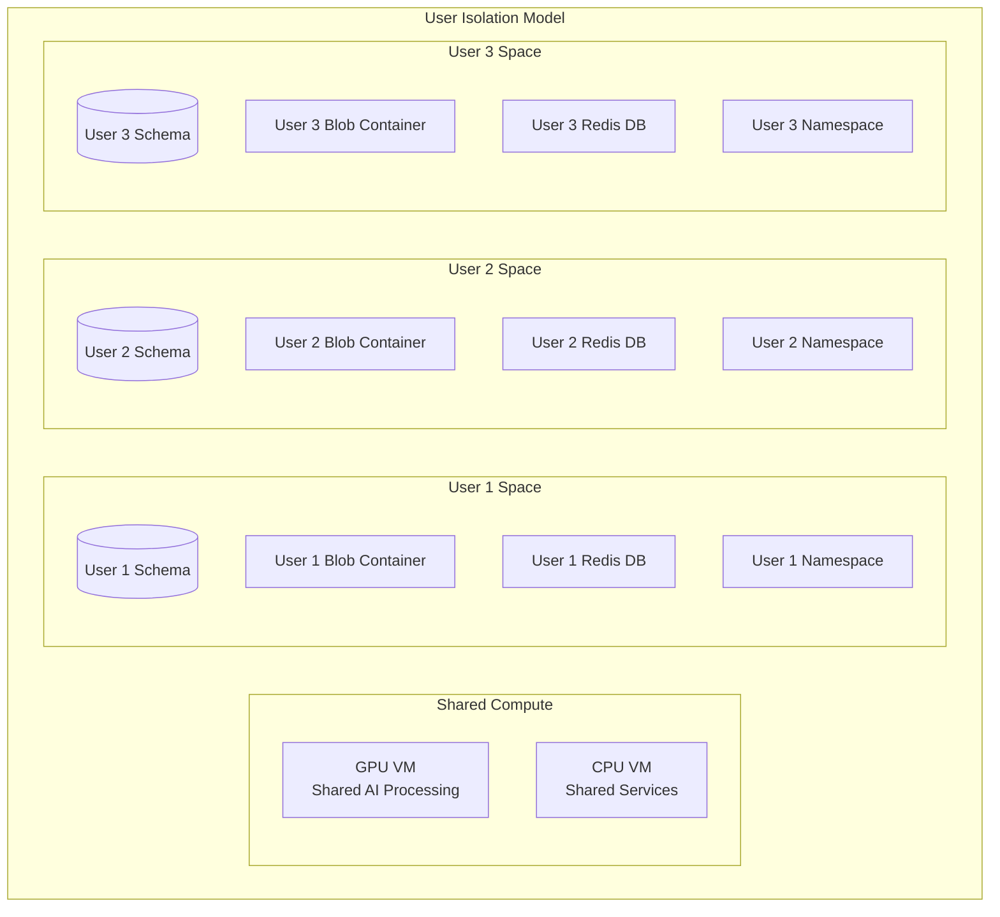

# 👥 Power User Data Isolation Strategy

## Architecture Overview

Each power user gets isolated resources while sharing compute:



## Implementation

### 1. Database Isolation (PostgreSQL Schemas)
```sql
-- Each user gets their own schema
CREATE SCHEMA user_001;
CREATE SCHEMA user_002;
CREATE SCHEMA user_003;

-- Shared schema for system data
CREATE SCHEMA shared;

-- User-specific tables
CREATE TABLE user_001.research_history (...);
CREATE TABLE user_001.tool_executions (...);
CREATE TABLE user_001.preferences (...);
```

### 2. Storage Isolation (Blob Containers)
```bash
# Each user gets dedicated containers
/models          # Shared AI models
/user-001/       # User 1 private data
  /research/
  /outputs/
  /documents/
/user-002/       # User 2 private data
/user-003/       # User 3 private data
```

### 3. Redis Isolation (Database Index)
```yaml
Redis Databases:
  0: System cache (shared)
  1: User 001 sessions/cache
  2: User 002 sessions/cache
  3: User 003 sessions/cache
  4: Queues (shared, but tagged)
```

### 4. Container Namespace Isolation
```yaml
# Docker compose with user namespaces
services:
  open-webui-user-001:
    environment:
      - USER_ID=001
      - DB_SCHEMA=user_001
      - REDIS_DB=1
      - STORAGE_PATH=/user-001
    labels:
      - "user=001"
    
  deep-researcher-user-001:
    environment:
      - USER_ID=001
      - ISOLATION_MODE=strict
```

## Scaling Considerations

### Current (3-5 Power Users)
- Manual user provisioning
- Shared GPU with queue system
- 10-20GB storage per user
- 100GB shared model cache

### Growth (10-20 Users)
- Automated provisioning
- GPU time-slicing or multiple GPUs
- 50GB storage per user
- Dedicated CPU resources per user

### Enterprise (50+ Users)
- Kubernetes with namespace isolation
- GPU cluster with scheduling
- Unlimited storage with quotas
- Dedicated VMs per team

## Data Evolution Strategy

### Research Data Growth
```yaml
Month 1: ~5GB per user
  - Research documents
  - Generated content
  - Tool execution logs

Month 6: ~50GB per user
  - Historical research archive
  - Model fine-tuning data
  - Collaboration artifacts

Year 1: ~200GB per user
  - Complete knowledge base
  - Custom models
  - Team shared resources
```

### Backup Strategy
```bash
# Daily incremental backups
User data: Azure Backup daily
Research: Blob snapshot daily
Database: Point-in-time restore (7 days)
Models: Immutable blob storage
```

## Access Control

### Authentication Layers
1. **Azure AD** - VM and service access
2. **Supabase Auth** - Application login
3. **User Context** - Data isolation
4. **Tool Permissions** - Per-user tool access

### Example User Profile
```json
{
  "user_id": "001",
  "name": "Power User Alpha",
  "tier": "premium",
  "resources": {
    "gpu_hours_monthly": 100,
    "storage_gb": 100,
    "api_calls_daily": 10000,
    "concurrent_research": 3
  },
  "enabled_tools": [
    "github", "vercel", "notion", "slack"
  ],
  "data_locations": {
    "database_schema": "user_001",
    "blob_container": "user-001",
    "redis_db": 1
  }
}
