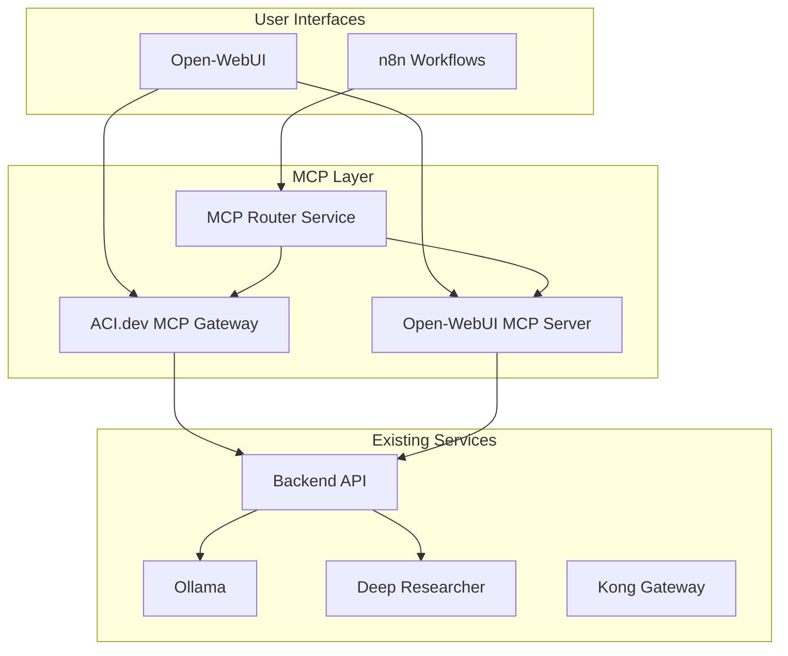

# MCP Integration Plan for GenAI Vanilla Stack

## 🎯 Executive Summary

This plan outlines the integration of two MCP (Model Context Protocol) implementations into the GenAI Vanilla Stack:
1. **ACI.dev MCP Servers** - Provides 600+ tools through Apps and Unified servers
2. **Open WebUI MCP Integration** - Native MCP support for Open WebUI

## 📊 Current State Analysis

### Existing Infrastructure
- **Open-WebUI**: Already running with Tools and Pipes support
- **Backend API**: FastAPI with client classes for service integration
- **n8n**: Workflow automation with webhook capabilities
- **Docker Compose**: Microservices orchestration
- **Kong Gateway**: API routing and management

### Existing MCP References
- README mentions future Docker MCP servers integration (Section 21)
- No current MCP implementations active

## 🏗️ Architecture Design

### Integration Approach



## 🔧 Implementation Plan

### Phase 1: ACI.dev MCP Integration (Week 1-2)

#### 1.1 Service Configuration

Create new MCP services in Docker Compose:

```yaml
# docker-compose.yml addition
aci-mcp-gateway:
  image: ghcr.io/aipotheosis-labs/aci-mcp:latest
  container_name: ${PROJECT_NAME}-aci-mcp
  restart: unless-stopped
  environment:
    - ACI_API_KEY=${ACI_API_KEY}
    - LINKED_ACCOUNT_OWNER_ID=${ACI_LINKED_ACCOUNT_ID}
    - TRANSPORT=sse
    - PORT=8100
  ports:
    - "${ACI_MCP_PORT}:8100"
  networks:
    - backend-bridge-network
  deploy:
    replicas: ${ACI_MCP_SCALE:-1}

aci-mcp-unified:
  image: ghcr.io/aipotheosis-labs/aci-mcp:latest
  container_name: ${PROJECT_NAME}-aci-mcp-unified
  restart: unless-stopped
  command: ["unified-server", "--allowed-apps-only", "--transport", "sse", "--port", "8101"]
  environment:
    - ACI_API_KEY=${ACI_API_KEY}
    - LINKED_ACCOUNT_OWNER_ID=${ACI_LINKED_ACCOUNT_ID}
  ports:
    - "${ACI_MCP_UNIFIED_PORT}:8101"
  networks:
    - backend-bridge-network
```

#### 1.2 Environment Variables

```bash
# .env.example additions
# ACI.dev MCP Configuration
ACI_API_KEY=your_aci_api_key
ACI_LINKED_ACCOUNT_ID=your_linked_account_id
ACI_MCP_SOURCE=container  # container, localhost, disabled
ACI_MCP_PORT=63022  # BASE_PORT + 22
ACI_MCP_UNIFIED_PORT=63023  # BASE_PORT + 23
ACI_MCP_SCALE=1
ACI_ENABLED_APPS=GITHUB,GMAIL,BRAVE_SEARCH,SLACK
```

#### 1.3 Backend Integration

Create ACI MCP client class:

```python
# backend/app/aci_mcp_client.py
import httpx
import asyncio
from typing import Dict, Any, List
import os
import json

class ACIMCPClient:
    def __init__(self):
        self.apps_server_url = os.getenv("ACI_MCP_URL", "http://aci-mcp-gateway:8100")
        self.unified_server_url = os.getenv("ACI_MCP_UNIFIED_URL", "http://aci-mcp-unified:8101")
        self.api_key = os.getenv("ACI_API_KEY")
        
    async def search_functions(self, intent: str, limit: int = 10) -> List[Dict]:
        """Search for available functions using Unified MCP Server"""
        async with httpx.AsyncClient() as client:
            response = await client.post(
                f"{self.unified_server_url}/mcp/v1/tools/call",
                json={
                    "name": "ACI_SEARCH_FUNCTIONS",
                    "arguments": {
                        "intent": intent,
                        "limit": limit
                    }
                }
            )
            return response.json()
    
    async def execute_function(self, function_name: str, arguments: Dict) -> Dict:
        """Execute a function using Unified MCP Server"""
        async with httpx.AsyncClient() as client:
            response = await client.post(
                f"{self.unified_server_url}/mcp/v1/tools/call",
                json={
                    "name": "ACI_EXECUTE_FUNCTION",
                    "arguments": {
                        "function_name": function_name,
                        "function_arguments": arguments
                    }
                }
            )
            return response.json()
    
    async def call_app_function(self, app: str, function: str, arguments: Dict) -> Dict:
        """Direct function call via Apps MCP Server"""
        async with httpx.AsyncClient() as client:
            response = await client.post(
                f"{self.apps_server_url}/mcp/v1/tools/call",
                json={
                    "name": f"{app}__{function}",
                    "arguments": arguments
                }
            )
            return response.json()
```

### Phase 2: Open WebUI MCP Integration (Week 2-3)

#### 2.1 Open WebUI MCP Server

Create custom MCP server for Open WebUI:

```python
# open-webui/mcp/server.py
from typing import Any, Dict
import asyncio
import json
from mcp.server import Server, NotificationOptions
from mcp.server.models import InitializationOptions
from mcp.types import Tool, TextContent
import httpx

class OpenWebUIMCPServer:
    def __init__(self):
        self.server = Server("open-webui-mcp")
        self.backend_url = "http://backend:8000"
        self.setup_handlers()
    
    def setup_handlers(self):
        @self.server.list_tools()
        async def handle_list_tools() -> list[Tool]:
            """List all available tools from backend and ACI"""
            tools = []
            
            # Get tools from backend
            async with httpx.AsyncClient() as client:
                response = await client.get(f"{self.backend_url}/api/tools")
                backend_tools = response.json()
                
            # Get tools from ACI MCP
            async with httpx.AsyncClient() as client:
                response = await client.get("http://aci-mcp-gateway:8100/mcp/v1/tools")
                aci_tools = response.json()
            
            return backend_tools + aci_tools
        
        @self.server.call_tool()
        async def handle_call_tool(name: str, arguments: dict) -> list[TextContent]:
            """Route tool calls to appropriate service"""
            
            # Determine routing based on tool name
            if name.startswith("ACI_"):
                # Route to ACI MCP
                result = await self.call_aci_tool(name, arguments)
            elif name in ["research", "image_generation"]:
                # Route to backend
                result = await self.call_backend_tool(name, arguments)
            else:
                # Check if it's an ACI app function
                result = await self.call_aci_app_function(name, arguments)
            
            return [TextContent(type="text", text=json.dumps(result))]
    
    async def call_aci_tool(self, name: str, arguments: dict):
        async with httpx.AsyncClient() as client:
            response = await client.post(
                "http://aci-mcp-unified:8101/mcp/v1/tools/call",
                json={"name": name, "arguments": arguments}
            )
            return response.json()
    
    async def call_backend_tool(self, name: str, arguments: dict):
        async with httpx.AsyncClient() as client:
            response = await client.post(
                f"{self.backend_url}/api/tools/{name}",
                json=arguments
            )
            return response.json()
```

#### 2.2 Open WebUI Configuration

Update Open WebUI to use MCP:

```python
# open-webui/functions/mcp_bridge.py
"""
title: MCP Bridge 🌉
author: GenAI Stack
version: 0.2.0
description: Bridge between Open WebUI and MCP servers
"""

import httpx
import json
from typing import AsyncGenerator, Dict, Any

class Pipe:
    """MCP Bridge for Open WebUI"""
    
    def __init__(self):
        self.name = "MCP Bridge 🌉"
        self.valves = self.Valves()
    
    class Valves(BaseModel):
        mcp_server_url: str = Field(
            default="http://open-webui-mcp:8200",
            description="MCP server URL"
        )
        aci_unified_url: str = Field(
            default="http://aci-mcp-unified:8101",
            description="ACI Unified MCP URL"
        )
        enable_tool_discovery: bool = Field(
            default=True,
            description="Enable dynamic tool discovery"
        )
    
    async def pipe(self, body: dict) -> AsyncGenerator:
        """Bridge Open WebUI to MCP servers"""
        
        user_message = body.get("messages", [])[-1].get("content", "")
        
        # Check if tool discovery is needed
        if self.valves.enable_tool_discovery:
            # Search for relevant tools
            tools = await self.discover_tools(user_message)
            
            if tools:
                yield f"🔍 Found {len(tools)} relevant tools\n"
                
                # Execute most relevant tool
                result = await self.execute_tool(tools[0], user_message)
                yield f"✅ Result: {result}\n"
        
        # Standard processing
        yield await self.process_with_mcp(user_message)
    
    async def discover_tools(self, intent: str):
        """Discover tools using ACI Unified MCP"""
        async with httpx.AsyncClient() as client:
            response = await client.post(
                f"{self.valves.aci_unified_url}/mcp/v1/tools/call",
                json={
                    "name": "ACI_SEARCH_FUNCTIONS",
                    "arguments": {"intent": intent, "limit": 5}
                }
            )
            return response.json()
```

### Phase 3: Service Integration (Week 3-4)

#### 3.1 n8n Integration

Create n8n nodes for MCP:

```json
// n8n/nodes/mcp-aci-node.json
{
  "node": "n8n-nodes-aci-mcp",
  "nodeVersion": "1.0",
  "codexVersion": "1.0",
  "details": {
    "displayName": "ACI MCP",
    "name": "aci-mcp",
    "icon": "file:aci.svg",
    "group": ["transform"],
    "version": 1,
    "description": "ACI.dev MCP Integration",
    "defaults": {
      "name": "ACI MCP"
    },
    "inputs": ["main"],
    "outputs": ["main"],
    "credentials": [
      {
        "name": "aciApi",
        "required": true
      }
    ],
    "properties": [
      {
        "displayName": "Operation",
        "name": "operation",
        "type": "options",
        "options": [
          {
            "name": "Search Functions",
            "value": "searchFunctions"
          },
          {
            "name": "Execute Function",
            "value": "executeFunction"
          }
        ],
        "default": "searchFunctions"
      }
    ]
  }
}
```

#### 3.2 Kong Gateway Configuration

Add MCP routes to Kong:

```yaml
# volumes/api/kong-mcp.yml
services:
  - name: aci-mcp-apps
    url: http://aci-mcp-gateway:8100
    
  - name: aci-mcp-unified
    url: http://aci-mcp-unified:8101
    
  - name: open-webui-mcp
    url: http://open-webui-mcp:8200

routes:
  - name: aci-mcp-apps-route
    service: aci-mcp-apps
    paths:
      - /mcp/apps
    strip_path: true
    
  - name: aci-mcp-unified-route
    service: aci-mcp-unified
    paths:
      - /mcp/unified
    strip_path: true
```

### Phase 4: Testing & Optimization (Week 4-5)

#### 4.1 Integration Tests

```python
# tests/test_mcp_integration.py
import pytest
import asyncio
from backend.app.aci_mcp_client import ACIMCPClient

@pytest.mark.asyncio
async def test_aci_function_search():
    client = ACIMCPClient()
    results = await client.search_functions("send email", limit=5)
    assert len(results) > 0
    assert any("GMAIL" in r.get("name", "") for r in results)

@pytest.mark.asyncio
async def test_mcp_coordination():
    """Test coordination between different MCP servers"""
    # Test Open WebUI -> ACI MCP flow
    # Test n8n -> ACI MCP flow
    # Test Backend -> MCP routing
```

#### 4.2 Performance Optimization

- Implement caching for frequently used tools
- Connection pooling for MCP servers
- Rate limiting and retry logic

## 📋 Configuration Files

### bootstrapper/service-configs.yml Addition

```yaml
aci-mcp:
  source_options:
    - container
    - localhost
    - disabled
  source_configs:
    container:
      scale: 1
      dependencies:
        - backend
    localhost:
      scale: 0
      external_url_required: true
      host_port: 8100
    disabled:
      scale: 0

open-webui-mcp:
  source_options:
    - container
    - disabled
  source_configs:
    container:
      scale: 1
      dependencies:
        - open-web-ui
        - backend
    disabled:
      scale: 0
```

### Port Management Update

```python
# bootstrapper/core/port_manager.py
PORT_ASSIGNMENTS = {
    # ... existing ports ...
    'ACI_MCP_PORT': 22,              # 63022
    'ACI_MCP_UNIFIED_PORT': 23,      # 63023
    'OPEN_WEBUI_MCP_PORT': 24,       # 63024
}
```

## 🚀 Deployment Steps

### Step 1: Environment Setup
```bash
# Add to .env
ACI_API_KEY=your_api_key
ACI_LINKED_ACCOUNT_ID=your_account_id
ACI_MCP_SOURCE=container
ACI_ENABLED_APPS=GITHUB,GMAIL,BRAVE_SEARCH
```

### Step 2: Build MCP Services
```bash
# Build Open WebUI MCP server
docker build -t genai-open-webui-mcp ./open-webui/mcp

# Pull ACI MCP image
docker pull ghcr.io/aipotheosis-labs/aci-mcp:latest
```

### Step 3: Update Docker Compose
```bash
# Merge MCP services into docker-compose.yml
./bootstrapper/start.py --enable-mcp
```

### Step 4: Start Services
```bash
docker compose up -d aci-mcp-gateway aci-mcp-unified open-webui-mcp
```

### Step 5: Verify Integration
```bash
# Test ACI MCP
curl http://localhost:63022/mcp/v1/tools

# Test Open WebUI MCP
curl http://localhost:63024/health

# Check logs
docker compose logs -f aci-mcp-gateway
```

## 🔍 Use Cases

### 1. Dynamic Tool Discovery in Chat
- User asks Open WebUI to "send an email"
- MCP Bridge searches ACI for email tools
- Discovers GMAIL__SEND_EMAIL
- Executes with user authorization

### 2. Workflow Automation
- n8n workflow triggers on schedule
- Uses ACI MCP to search GitHub repos
- Processes results with Deep Researcher
- Sends summary via Slack (through ACI)

### 3. Multi-Tool Orchestration
- Backend API receives complex request
- Uses ACI Unified MCP to discover needed tools
- Coordinates multiple tool executions
- Returns aggregated results

## 🛡️ Security Considerations

1. **API Key Management**
   - Store ACI API keys in Docker secrets
   - Rotate keys regularly
   - Use separate keys for different environments

2. **Network Isolation**
   - MCP servers on internal network only
   - Kong Gateway for external access
   - Rate limiting on all endpoints

3. **Access Control**
   - User-specific linked account IDs
   - Tool permission management
   - Audit logging for all executions

## 📊 Monitoring & Observability

### Metrics to Track
- Tool discovery latency
- Function execution success rate
- MCP server response times
- Error rates by service

### Logging Strategy
```yaml
logging:
  driver: "json-file"
  options:
    max-size: "10m"
    max-file: "3"
    labels: "service=mcp"
```

## 🎯 Success Metrics

- **Tool Coverage**: 600+ tools accessible
- **Response Time**: < 500ms for tool discovery
- **Success Rate**: > 95% execution success
- **Integration Points**: 5+ services using MCP

## 📅 Timeline

- **Week 1-2**: ACI.dev MCP setup and basic integration
- **Week 2-3**: Open WebUI MCP implementation
- **Week 3-4**: Service integration and routing
- **Week 4-5**: Testing and optimization
- **Week 5-6**: Documentation and deployment

## 🔄 Next Steps

1. **Immediate Actions**
   - Sign up for ACI.dev account
   - Obtain API keys
   - Review existing service integrations

2. **Development Priorities**
   - Create MCP client classes
   - Update Docker Compose
   - Implement basic routing

3. **Future Enhancements**
   - Add more MCP providers
   - Implement tool caching
   - Create UI for tool management

## 📚 References

- [ACI.dev Documentation](https://www.aci.dev/docs)
- [MCP Specification](https://modelcontextprotocol.io)
- [Open WebUI Pipes Documentation](https://docs.openwebui.com)
- [Docker MCP Servers](https://github.com/docker/mcp-servers)

---

This integration will transform the GenAI Vanilla Stack into a comprehensive AI platform with access to 600+ tools through intelligent MCP orchestration.
