# 🔌 ACI Integration Guide

## How ACI Integrates with Your Stack

### 🎯 Integration Overview


## 1️⃣ Open WebUI Integration

### How It Works
The **`aci_selfhosted_bridge.py`** function acts as a bridge between Open WebUI and the self-hosted ACI platform.

### Features
- **Tool Discovery**: Automatically finds relevant tools based on chat context
- **Natural Language Execution**: Execute tools using natural language commands
- **Result Formatting**: Presents tool results in a user-friendly format
- **Error Handling**: Graceful error handling with helpful messages

### Usage Examples

**User**: "Create a new GitHub repository called my-awesome-project"
```
🔍 Searching for relevant tools...
Found: GitHub - create_repository
🔧 Executing...
✅ Repository created: https://github.com/user/my-awesome-project
```

**User**: "Deploy my app to Vercel from the main branch"
```
🔍 Searching for relevant tools...
Found: Vercel - create_deployment
🔧 Executing...
✅ Deployment started: https://my-app.vercel.app
```

**User**: "Save this research to Notion and notify the team on Slack"
```
🔍 Searching for relevant tools...
Found: 
1. Notion - create_page
2. Slack - send_message
🔧 Executing workflow...
✅ Saved to Notion: https://notion.so/research-123
✅ Team notified in #general
```

### Configuration
In Open WebUI → Functions → ACI Self-Hosted Bridge:
```python
# Default configuration
aci_backend_url = "http://aci-backend:8000"
use_mcp_unified = True  # Dynamic discovery
priority_apps = "GITHUB,VERCEL,SLACK,NOTION"
```

## 2️⃣ Deep Researcher Integration

### How It Works
The **`deep-researcher-aci-client.py`** enhances Deep Researcher with the ability to:
- Save research results to multiple platforms
- Gather additional context from various sources
- Send notifications when research completes
- Create tasks from research findings

### Enhanced Capabilities

#### Save Research Results
```python
# Automatically saves to configured platforms
await researcher.research_with_tools(
    query="Latest AI developments",
    save_results=True,  # Saves to Notion, Google Docs
    notify=True,        # Notifies via Slack
)
```

#### Gather GitHub Context
```python
# Enriches research with GitHub data
result = await researcher.research_with_tools(
    query="How does authentication work?",
    gather_github=True,
    github_repo="user/project"
)
# Includes: issues, code snippets, recent commits
```

#### Create Action Items
```python
# Creates Jira tickets from findings
await aci_client.create_jira_ticket(
    project_key="PROJ",
    research_data=research_result
)
```

### Configuration
Set environment variables:
```env
RESEARCHER_SAVE_PLATFORMS=notion,google_docs,obsidian
RESEARCHER_NOTIFY_CHANNELS=#research,#team
ACI_BACKEND_URL=http://aci-backend:8000
```

## 3️⃣ n8n Workflow Integration

### How It Works
Custom n8n nodes allow you to use any ACI tool as a workflow step, enabling complex automation across 600+ services.

### Available Nodes

#### ACI Tool Executor (Generic)
- Execute any tool from any app
- Dynamic tool discovery
- Parameter configuration
- Error handling

#### Specialized Nodes
- **ACI GitHub**: Repository, issues, PRs, workflows
- **ACI Vercel**: Deployments, projects, domains  
- **ACI Notion**: Pages, databases, blocks
- **ACI Slack**: Messages, channels, users

### Example Workflows

#### CI/CD Pipeline
```
Trigger: GitHub Push
  ↓
[ACI GitHub] Get commit info
  ↓
[ACI Vercel] Create deployment
  ↓
[ACI Slack] Notify team
  ↓
[ACI Sentry] Create release
```

#### Content Publishing
```
Trigger: RSS Feed
  ↓
[ACI Tool] Search for context
  ↓
[Deep Researcher] Enhance content
  ↓
[ACI Notion] Save to database
  ↓
[ACI Twitter/X] Post thread
  ↓
[ACI Discord] Share in channel
```

#### Data Sync
```
Trigger: Schedule (daily)
  ↓
[ACI Google Sheets] Get data
  ↓
[Transform] Process data
  ↓
[ACI Supabase] Update database
  ↓
[ACI Gmail] Send report
```

### Installation in n8n

1. **Copy node files**:
```bash
cp aci-integration/integrations/n8n-aci-node.ts \
   n8n/custom-nodes/
```

2. **Install in n8n**:
```bash
docker exec -it genai-n8n \
  npm install /data/custom-nodes/n8n-aci-node.ts
```

3. **Restart n8n**:
```bash
docker compose restart n8n
```

4. **Configure credentials** in n8n UI:
   - Backend URL: `http://aci-backend:8000`
   - API Key: (optional)

## 🔄 Combined Workflows

### Research → Document → Deploy

1. **Deep Researcher** finds information
2. **ACI Tools** save to Notion/Docs
3. **n8n Workflow** triggers deployment
4. **Open WebUI** monitors progress

### Example: Full Stack Development

```mermaid
sequenceDiagram
    participant User
    participant OpenWebUI
    participant DeepResearcher
    participant ACI
    participant GitHub
    participant Vercel
    participant Slack
    
    User->>OpenWebUI: "Research and deploy auth solution"
    OpenWebUI->>DeepResearcher: Research query
    DeepResearcher->>ACI: Gather GitHub examples
    ACI->>GitHub: Search repositories
    GitHub-->>ACI: Return examples
    ACI-->>DeepResearcher: Enhanced research
    DeepResearcher->>ACI: Save to Notion
    ACI->>GitHub: Create repository
    ACI->>Vercel: Deploy project
    ACI->>Slack: Notify team
    Slack-->>User: "✅ Auth solution deployed"
```



## 🛠️ Advanced Features

### Dynamic Tool Chains
Build complex tool chains that adapt based on results:

```python
# In Open WebUI or Deep Researcher
if github_result.has_issues:
    await aci.execute("jira", "create_issue", {...})
    await aci.execute("slack", "alert_team", {...})
else:
    await aci.execute("vercel", "deploy", {...})
    await aci.execute("discord", "announce", {...})
```

### Conditional Workflows in n8n
Use ACI tool results to branch workflows:

```javascript
// n8n Function node
const searchResult = $node["ACI Search"].json;
if (searchResult.tools.includes("github")) {
    // GitHub-specific workflow
} else {
    // Alternative workflow
}
```

### Parallel Execution
Execute multiple tools simultaneously:

```python
# Execute in parallel
results = await asyncio.gather(
    aci.execute("notion", "create_page", {...}),
    aci.execute("slack", "send_message", {...}),
    aci.execute("gmail", "send_email", {...})
)
```

## 📈 Monitoring & Debugging

### View Tool Executions
Access the ACI Portal to see:
- Tool execution history
- Success/failure rates
- Performance metrics
- Error logs

### Debug in n8n
- Use n8n's execution history
- View input/output for each node
- Set breakpoints for testing

### Logs
```bash
# ACI Backend logs
docker compose logs -f aci-backend

# Check specific tool execution
curl http://localhost:63026/v1/executions/[execution_id]
```

## 🎯 Best Practices

1. **Start Simple**: Test individual tools before building complex workflows
2. **Use Caching**: ACI caches tool definitions for performance
3. **Handle Errors**: Always include error handling in workflows
4. **Secure Credentials**: Store OAuth tokens and API keys securely
5. **Rate Limiting**: Respect API rate limits of external services
6. **Test Locally**: Test workflows locally before production
7. **Document Workflows**: Keep documentation of complex automations

## 🚀 Next Steps

1. **Configure Your First Tool**:
   - Go to ACI Portal (http://localhost:63027)
   - Select an app (e.g., GitHub)
   - Add credentials
   - Test execution

2. **Try in Open WebUI**:
   - Enable ACI Bridge function
   - Ask to perform an action
   - Watch it execute

3. **Build a Workflow**:
   - Open n8n
   - Add ACI nodes
   - Connect services
   - Test and deploy

4. **Enhance Research**:
   - Configure Deep Researcher
   - Enable tool integrations
   - Run enhanced research
